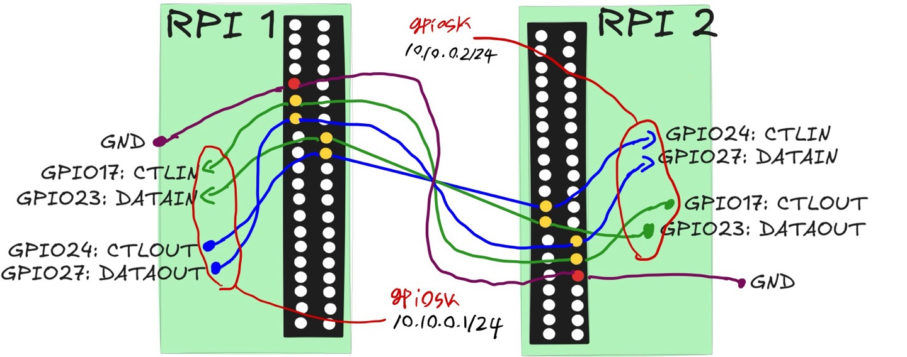
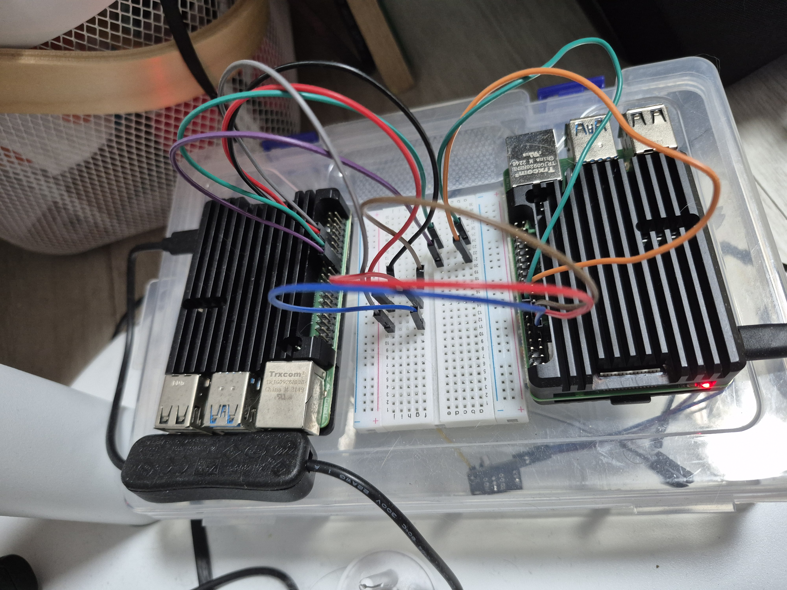

# gpiosk

GPIO based Linux socket kernel module



# what is this?

This kernel module is no different from a plain old Linux networking interface...\
except it uses GPIO to send and receive data

### interface info

```shell
# on rpi1
# ip a
15: geth0: <BROADCAST,MULTICAST,UP,LOWER_UP> mtu 1500 qdisc pfifo_fast state UNKNOWN group default qlen 1000
    link/ether 47:45:54:48:30:36 brd ff:ff:ff:ff:ff:ff
    inet 10.10.0.1/24 scope global geth0
       valid_lft forever preferred_lft forever
    inet6 fe80::4545:54ff:fe48:3036/64 scope link 
       valid_lft forever preferred_lft forever

```

```shell

# on rpi2
# ip a

1: geth0: <BROADCAST,MULTICAST,UP,LOWER_UP> mtu 1500 qdisc pfifo_fast state UNKNOWN group default qlen 1000
    link/ether 47:45:54:48:30:33 brd ff:ff:ff:ff:ff:ff
    inet 10.10.0.2/24 scope global geth0
       valid_lft forever preferred_lft forever
    inet6 fe80::4545:54ff:fe48:3033/64 scope link 
       valid_lft forever preferred_lft forever

```

### tcp communication using nc
```shell
# on rpi2
$ nc -l 10.10.0.2 9999
helllo
echo
bye
```

```shell
# on rpi1
$ nc 10.10.0.2 9999
helllo
echo
bye

```

# specification

So far, I only tested it on my raspberry pi 4b with spec below

```shell
# lscpu
Architecture:             aarch64
  CPU op-mode(s):         32-bit, 64-bit
  Byte Order:             Little Endian
CPU(s):                   4
  On-line CPU(s) list:    0-3
Vendor ID:                ARM
  Model name:             Cortex-A72
    Model:                3
    Thread(s) per core:   1
    Core(s) per cluster:  4
    Socket(s):            -
    Cluster(s):           1
    Stepping:             r0p3
    CPU(s) scaling MHz:   33%
    CPU max MHz:          1800.0000
    CPU min MHz:          600.0000
    BogoMIPS:             108.00
    Flags:                fp asimd evtstrm crc32 cpuid
```

```shell
# uname -a
Linux raspberrypi 6.12.25+rpt-rpi-v8 #1 SMP PREEMPT Debian 1:6.12.25-1+rpt1 (2025-04-30) aarch64 GNU/Linux
```

# how to

1. physical wiring

- blueprint


- actual



2. build

```shell
make
```

3. configure

```shell
# check ins.conf.tmpl
```

4. insmod

```shell
sudo ./ins.sh
```

